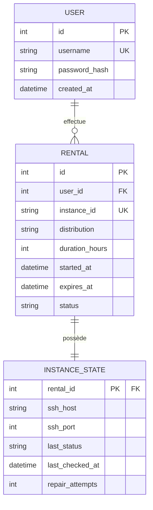

```mermaid
erDiagram
    USER ||--o{ RENTAL : "effectue"
    RENTAL ||--|| INSTANCE_STATE : "possède"

    USER {
        int id PK
        string username UK
        string password_hash
        datetime created_at
    }

    RENTAL {
        int id PK
        int user_id FK
        string instance_id UK
        string distribution
        int duration_hours
        datetime started_at
        datetime expires_at
        string status
    }

    INSTANCE_STATE {
        int rental_id PK "FK"
        string ssh_host
        int ssh_port
        string last_status
        datetime last_checked_at
        int repair_attempts
    }
```
